[](https://github.com/bantupallisarath7/Helping-Hands-Organization---Web-Application)


# 🙌 Helping Hands Organization Application

## 📖 Overview 
Helping Hands Organization is a **Single Page Application (SPA)** built with the **MERN stack** (MongoDB, Express.js, React, Node.js) and styled using **Tailwind CSS**.  
It is a **role-based donation management system** designed for organizations to manage campaigns, donations, events, and galleries.

The application supports two roles:
- **User**: Can sign up, view/edit their donations, and create campaigns.
- **Admin**: Can approve/reject campaigns, manage donations, events, galleries, and users.

---

## 🛠 Tech Stack
- **Frontend**: React + Tailwind CSS
- **Backend**: Node.js + Express.js
- **Database**: MongoDB
- **Authentication**: Role-based (User/Admin)

---

## 📂 Project Structure

### 🌐 Frontend (`/frontend`)
```
frontend/
├── public/                     # Static assets (favicon, index.html)
├── redux/
│   ├── user/                   # Redux slice for user state
│   └── store.js                # Redux store configuration
├── src/
│   ├── assets/                 # Images, icons
│   ├── Component/
│   │   ├── Admin/              # Admin-specific components
│   │   ├── Cards/              # Reusable card components
│   │   ├── LandingPage/        # Hero, intro, and CTA sections
│   │   ├── NavbarComponents/   # Navbar links, dropdowns
│   │   ├── UserSidebar/        # Sidebar for user dashboard
│   │   ├── Dashboard.jsx       # Main dashboard layout
│   │   ├── Menu.jsx            # Sidebar menu logic
│   │   └── Navbar.jsx          # Top navigation bar
│   ├── Pages/
│   │   ├── Loader.jsx          # Loading spinner
│   │   ├── Signin.jsx          # Login page
│   │   └── Signup.jsx          # Registration page
│   ├── utils/                  # Helper functions and constants
│   ├── App.css                 # Global styles
│   ├── App.jsx                 # Root component
│   └── main.jsx                # Entry point
├── package.json                # Dependencies and scripts
├── vite.config.js              # Vite build configuration
└── eslint.config.js            # Linting rules
```

### 🔧 Backend (`/backend`)
```
backend/
├── Controllers/
│   ├── adminController/              # Admin logic
│   ├── campaignControllers/          # Campaign CRUD
│   ├── donationReceiptsControllers/  # Donation receipt handling
│   ├── eventControllers/             # Event management
│   ├── feedbackController/           # User feedback
│   ├── galleryController/            # Image gallery logic
│   └── userControllers/              # User auth and profile
├── ErrorHandlers/
│   └── errorHandler.js               # Centralized error handling
├── Middlewares/
│   ├── uploadProfileStorage.js       # Profile image upload config
│   ├── uploadStorage.js              # General file upload config
│   ├── verifyAdmin.js                # Admin access middleware
│   └── verifyToken.js                # Auth token verification
├── Models/
│   ├── Campaign.js                   # Campaign model                 
│   ├── DonationReceipt.js            # Donation Receipt model
│   ├── Event.js                      # Event model
│   ├── Feedback.js                   # Feedback model
│   ├── Gallery.js                    # Gallery model
|   └── User.js                       # User model
├── Routes/
│   ├── adminRoutes.js                # Admin routes
│   ├── campaignRoutes.js             # Campaign routes
│   ├── donationReceiptRoutes.js      # Donation Receipt routes
│   ├── feedbackRoutes.js             # Feedback routes
│   └── userRoutes.js                 # User routes
├── uploads/                          # Uploaded files and images
├── Server.js                         # Express server entry point
├── .env                              # Environment variables
├── package.json                      # Backend dependencies
└── package-lock.json
```

---

## 🚀 Features

### 👤 User
- Sign up / log in to access features.
- View and edit personal donations.
- Create campaigns (initially **Pending**).
- Track campaign status: **Pending → Approved → Funded / Rejected**.
- Submit donation receipts for recognition.
- View approved campaigns, events, and gallery.

### 🛡️ Admin
- Approve or reject campaigns.
- Manage donation receipts (approve/reject).
- Manage events and gallery.
- Manage users and their roles.

---

## 💡 Campaign Lifecycle

1. **User creates a campaign** → Status: `Pending`.
2. **Admin reviews** → Status: `Approved` or `Rejected`.
3. **Approved campaigns** → Visible publicly for donations.
4. **Donations** → Added via receipts submitted by donors.
5. **Admin approves receipts** → Donation amount reflected in user dashboard and campaign total.
6. **Campaigns can be marked as `Funded`** once goals are met.

---


## 📸 Screenshots

## Landing Page
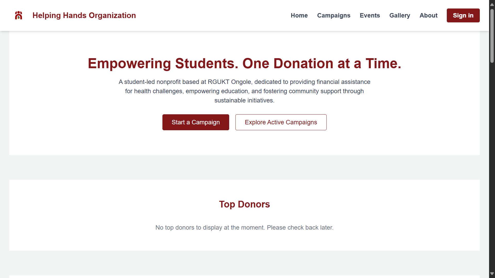

## Sign Up
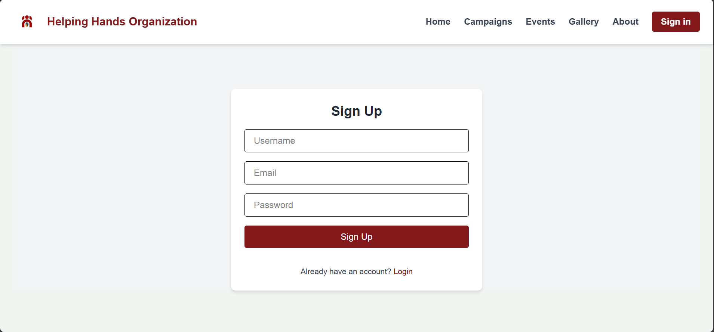

## Sign In
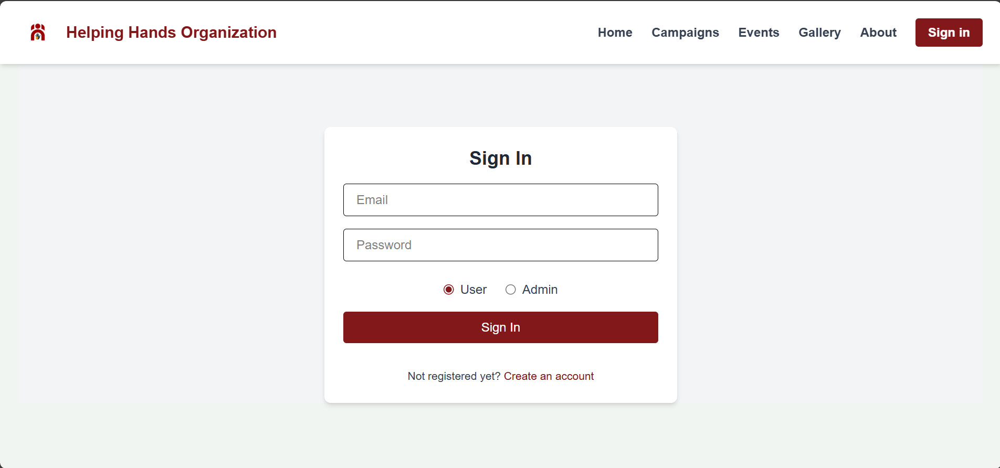

## Gallery
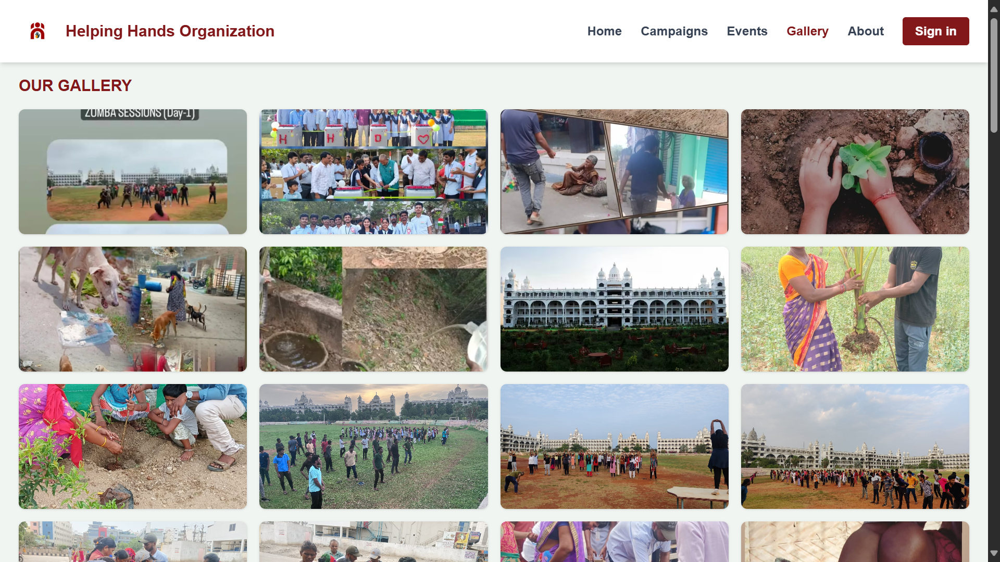

---

## Admin Dashboard
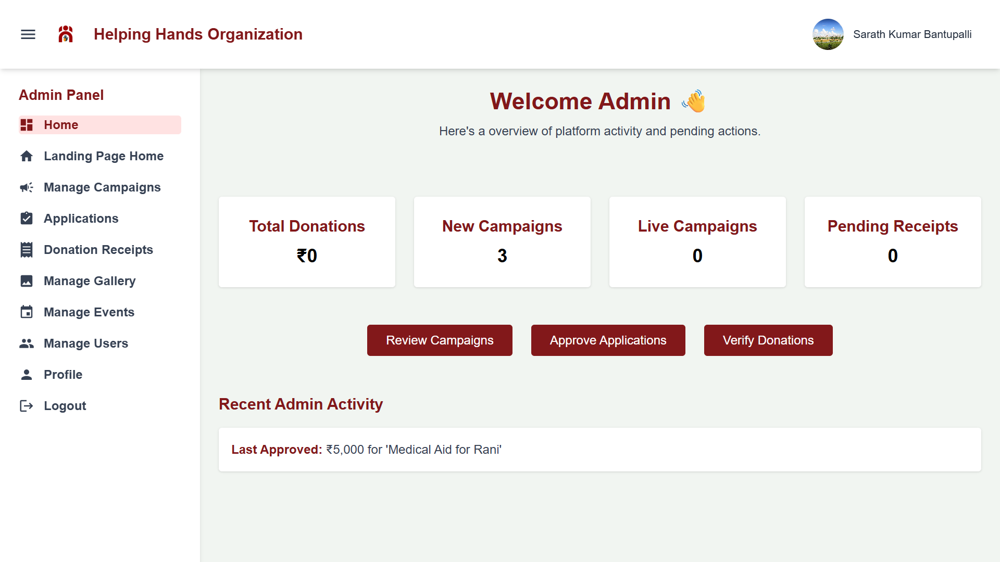

## User Dashboard
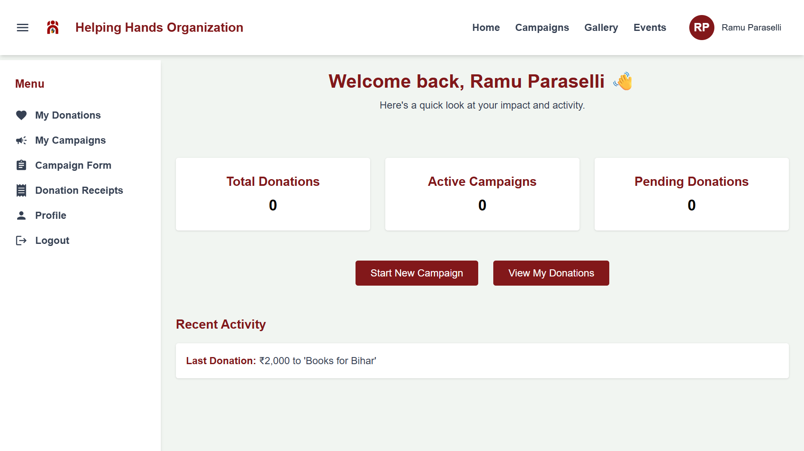

## Admin/User Profile
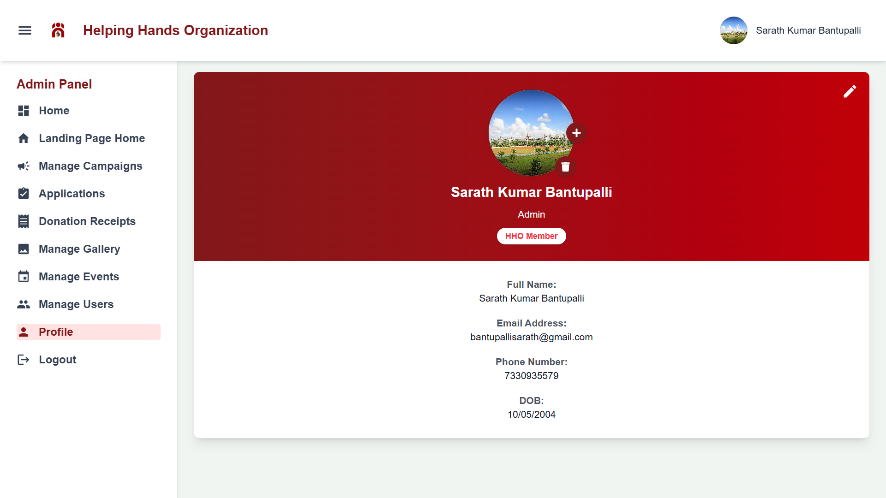

---
## Campaign Creation Form
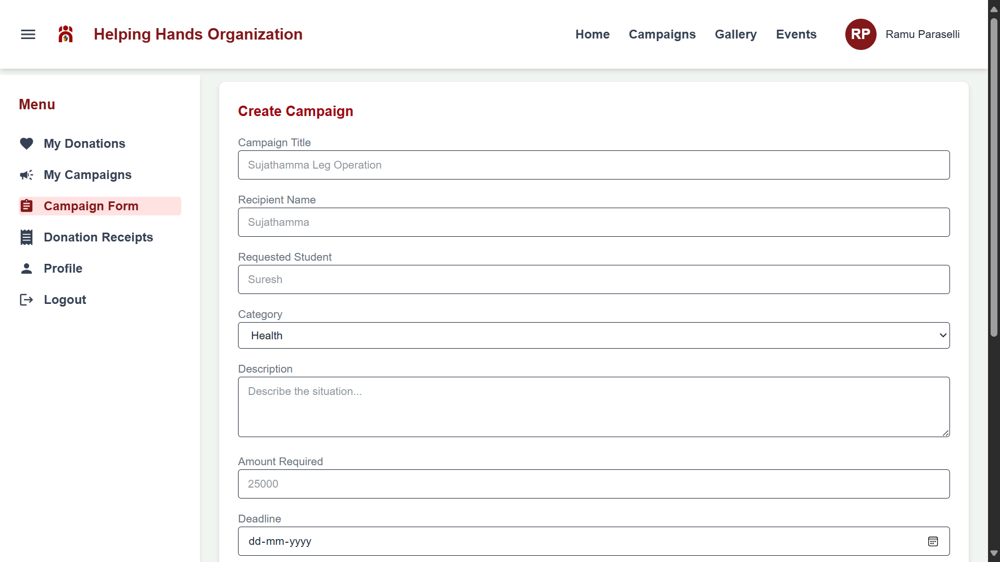

## User Campaigns
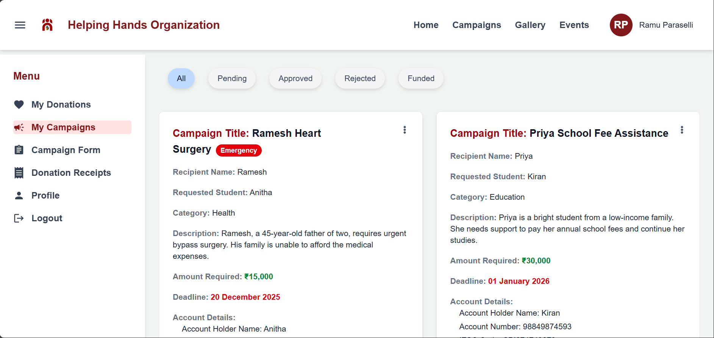

## Manage Campaigns
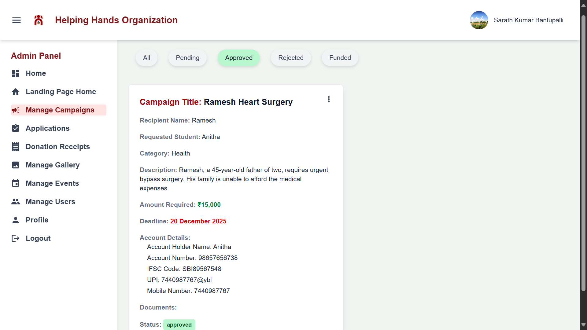

## Campaign View
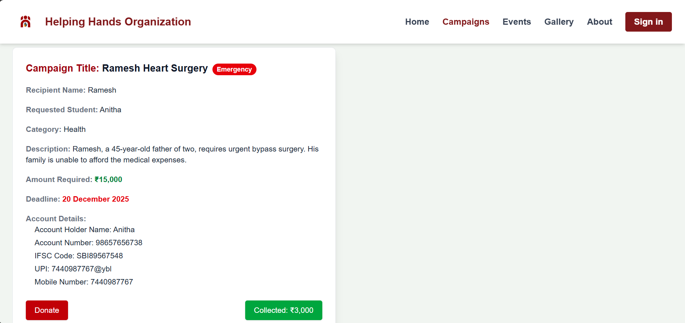

---

## Donation Form
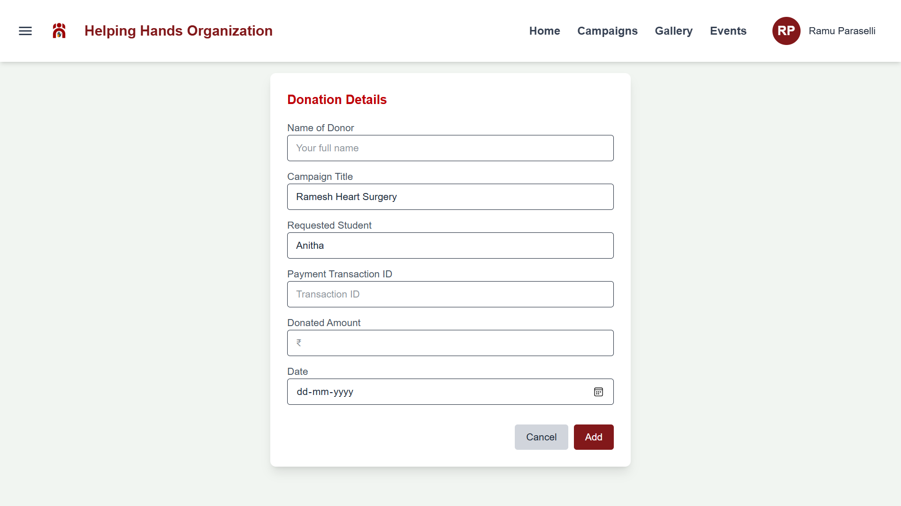

## Manage Donation Receipts
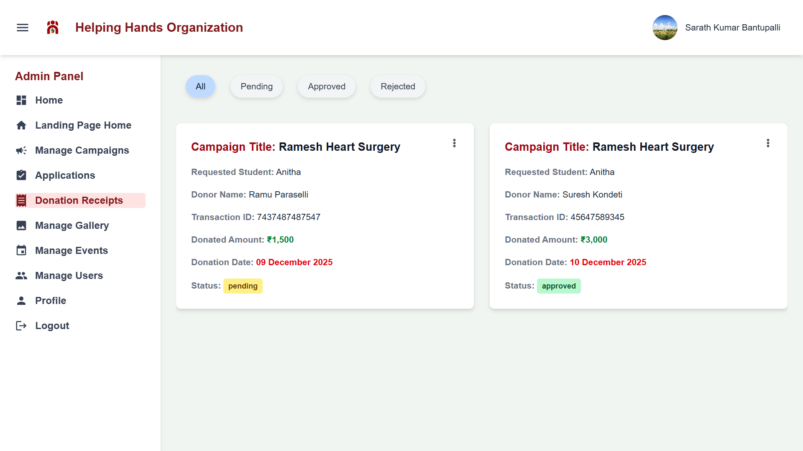

## User Donations


---

## Events
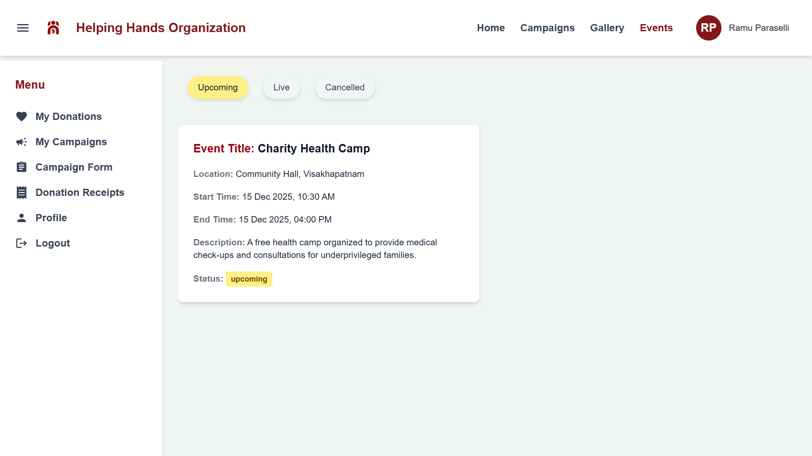

## Manage Events
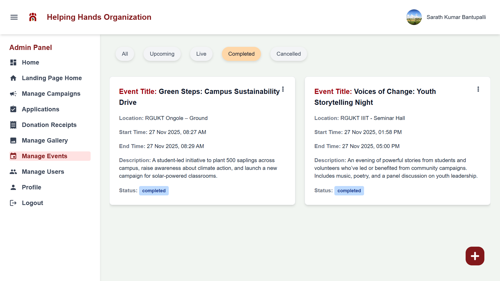

---

## Feedback
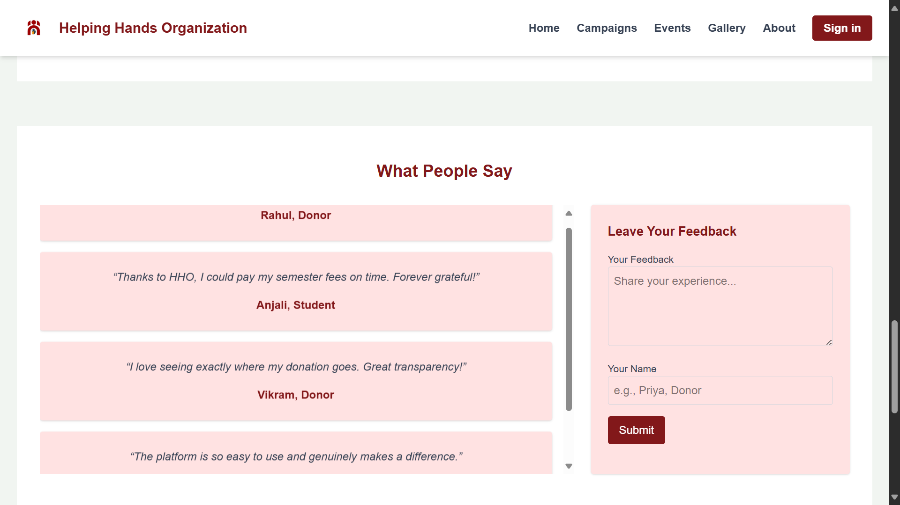


## ⚙️ Installation

```bash
# Clone the repository
git clone https://github.com/bantupallisarath7/Helping-Hands-Organization---Web-Application.git


# Backend setup
cd backend
npm install
npm run dev

# Frontend setup
cd ../frontend
npm install
npm start
